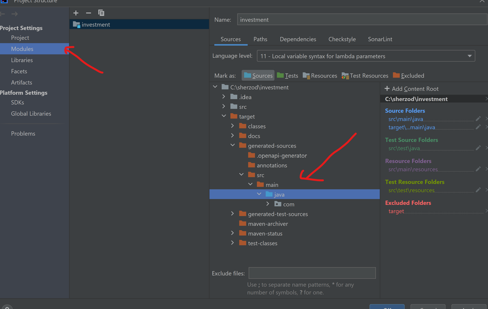

# Crypto Investment

-----------------

### Prerequisites:
- Install Docker
- Clone the repo in your machine

Build and Run application
---------------------------
To start the Docker container, run the following command in your project directory:
`docker-compose up -d`

Swagger
----------
Swagger provides information about the REST endpoints of this application, which can be
accessed through the URL http://127.0.0.1:8080/swagger-ui/index.html.
The following endpoints are available:

- GET `/api/v1/cryptos/statistics/{crypto}`  Returns the oldest/newest/min/max values for a requested crypto for all available
  data
- GET `/api/v1/cryptos/range` Returns a descending sorted list of all the cryptos, comparing the normalized range (
  i.e. (max-min)/min).
- GET `/api/v1/cryptos/range/highest/{date}` Returns the crypto with the highest normalized range for a specific day

Recommendation service requirements:
----------

Reads all the prices from the csv files
----------
The application reads prices from files located in the `resource/prices` folder of the project and 
stores all data to Postgresql database.

Calculates oldest/newest/min/max for each crypto for the whole month
-------
Implemented endpoints able to calculate for "whole time interval", not only one month

Things to consider:
------
Documentation is our best friend, so it will be good to share one for the endpoints
------
Swagger is able on url: http://127.0.0.1:8080/swagger-ui/index.html
OpenAPI 3 is used for building and documenting RESTful APIs. It provides a standardized format for describing
an API's endpoints, parameters, responses, and other important details. provides a way to generate code for client libraries, 
server stubs, and other API-related components. 
This can save time and effort when building applications that consume or provide APIs. Here is yaml file:
`/src/main/resources/swagger.api/crypto.yaml`

Note: If you don't see generated codes when working in Intellij Idea, mark directory as a source root as shown in the following screenshot

Initially the cryptos are only five, but what if we want to include more? Will the recommendation service be able to scale?
------
Certainly, If you wish to add more than the initial five cryptocurrencies, the recommendation service 
will be able to scale to accommodate them. This is due to the implementation of Redis, which is 
a high-performance and flexible solution for caching data. Redis can help improve the performance of
the application by caching frequently accessed data in memory, thereby reducing the load on the database. 
Additionally, in a production environment, Redis can be configured to support replication and clustering,
which enables data to be distributed across multiple servers.

New cryptos pop up every day, so we might need to safeguard recommendations service endpoints from not currently supported cryptos
------
Yes, it was handled

For some cryptos it might be safe to invest, by just checking only one month's time frame. However, for some of them it might be more accurate to check six months or even a year. Will the recommendation service be able to handle this?
------
Yes, it could handle any period of time

Extra mile for recommendation service (optional):
-------
In XM we run everything on Kubernetes, so containerizing the recommendation service will add great value
-------

Malicious users will always exist, so it will be really beneficial if at least we can rate limit them (based on IP)
-----
Bucket4J is currently being used for rate limiting. However, in a production-ready environment with high traffic, it is
recommended to use Load Balancers to ensure proper scaling and distribution of traffic across multiple servers.